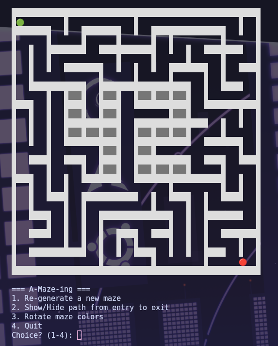

# 🧩 A-Maze-ing — Python Maze Generator


A configurable and fully automated maze generator built in Python.  
It can generate perfect mazes, solve them using BFS, and export results in hexadecimal format.

---

## 🖼️ Example Output



---

## 🚀 Overview

**A-Maze-ing** is a Python-based maze generation engine developed as part of the 42 curriculum.

The program:

- 🔹 Reads a configuration file  
- 🔹 Generates a random maze  
- 🔹 Embeds a visible **"42" pattern**  
- 🔹 Solves the maze using BFS  
- 🔹 Exports the maze in hexadecimal format  

This project demonstrates strong understanding of:

- Algorithms  
- Graph traversal  
- File parsing  
- Clean Python architecture  

---

## ✨ Features

- Multiple maze generation algorithms  
- Perfect maze support  
- Shortest path solver (BFS)  
- Configurable via `config.txt`  
- Hexadecimal export format  
- ASCII terminal visualization  
- Deterministic generation via seed  

---

## 🧠 Algorithms Used

### Maze Generation

- **Recursive Backtracker (DFS)** — default  
- **Prim’s Algorithm** — alternative  

### Maze Solving

- **Breadth-First Search (BFS)**  
  - Guarantees shortest path  
  - Efficient on grid graphs  

---

## 📁 Project Structure

```text
.
├── a_maze_ing.py          # Main executable file
├── mazegen/mazegen.py     # Maze generator
├── config.txt             # Example configuration
├── Makefile
├── README.md
├── .gitignore
├── read_config_file.py    # Config parser
└── pyproject.toml
```

---

## ⚙️ Installation

```bash
make install
```

---

## ▶️ Run

```bash
make run
# or
python3 a_maze_ing.py config.txt
```

---

## 🐞 Debug

```bash
make debug
```

---

## 🧹 Lint

```bash
make lint
# or
make lint-strict
```

---

## 🧽 Clean

```bash
make clean
```

---

## 🔧 Configuration File

### Format

- One `KEY=VALUE` per line  
- Lines starting with `#` are ignored  

### Mandatory Keys Example

```
WIDTH=14
HEIGHT=14

ENTRY=0,0
EXIT=13,13
OUTPUT_FILE=maze.txt
PERFECT=True
```

### Optional Key

```
SEED=42
```

A default configuration file is provided in the repository.

---

## 📤 Output Format

Each cell is encoded using **one hexadecimal digit**:

- `1` → wall closed  
- `0` → wall open  

Cells are written row by row.

After an empty line:

1. Entry coordinates  
2. Exit coordinates  
3. Shortest valid path using `N E S W`  

---

## 🖥️ Visualization

The maze can be displayed using:

- **Terminal ASCII rendering** (default)

Features:

- regenerate maze  
- show / hide shortest path  
- change wall colors  

---

## 📄 License

This project is licensed under the MIT License.
